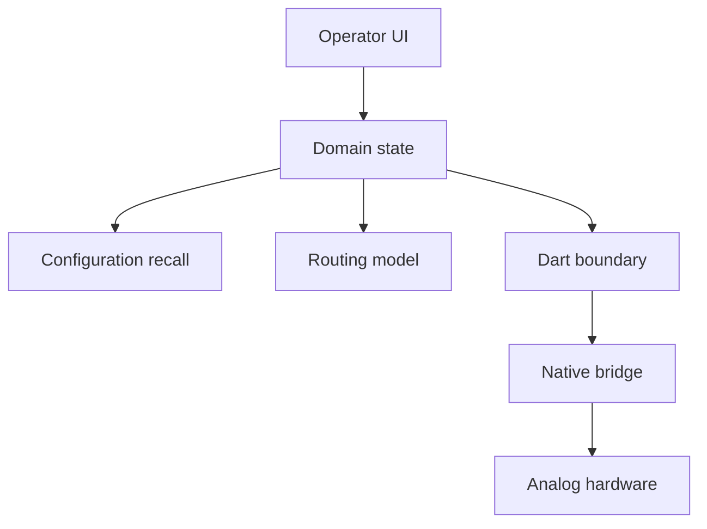
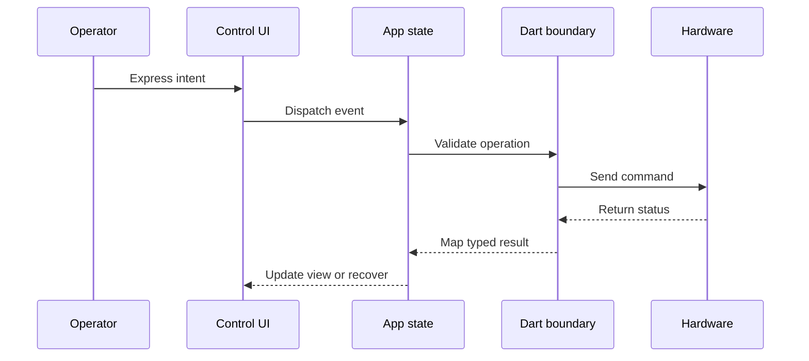

# SEPIA

## Executive Content

### Overview

SEPIA is a modular true-analog audio platform with a digital control plane. Authentic hardware circuitry stays in compact modules while software handles control, routing, automation, and recall. This case study focuses on making that boundary reliable as the system changes in real time.

### Product narrative

SEPIA by Karno is built around a practical studio and live-sound problem: engineers want analog character without giving up instant recall, automation, and remote control. Instead of modeling analog behavior in DSP, SEPIA keeps signal processing physical and moves control into software.

The platform uses a three-tier system:

1. Control surfaces: DAW plugins, digital consoles, and mobile/tablet interfaces.
2. Host chassis: a rack mainframe with control engine, analog crossbar matrix, and high-density I/O.
3. Analog modules: hot-swappable processing cartridges with real analog circuitry.

This split allows the control layer to evolve quickly while the audio path remains analog and low-latency.

### What makes SEPIA different

Traditional analog racks offer tone but weak recall. Plugins offer recall but simulated tone. SEPIA combines both by isolating responsibilities:

- Analog path: physical circuitry does the sound shaping.
- Digital layer: software handles automation, snapshot recall, telemetry, and routing commands.
- Host matrix: route and reorder analog stages without inserting extra A/D-D/A conversions in the intermediate path.

The result is not a plugin clone of hardware. It is hardware-first processing with software-grade control.

### The challenge behind the product

The control application operates against moving hardware conditions. Hosts reconnect with changed identity, modules move slots, capabilities differ per device, and asynchronous notifications can arrive after a user action. The system has to answer a hard question repeatedly: should this saved intent still be applied, partially applied, or blocked for safety?

The engineering contribution was not only UI delivery. It covered the boundaries that make hardware variance understandable: communication abstraction, lifecycle ownership, recovery semantics, routing conversion, and testable behavior under asynchronous conditions.

### Why it was difficult

Several difficult concerns had to work together:

- A typed application boundary over complex device communication.
- Lifecycle ownership for discovery, reconnect, and cleanup.
- Visual routing that must become deterministic hardware operations.
- Configuration recovery when saved state no longer matches live topology.
- Meaningful testing without requiring physical hardware in every flow.

### The approach

The architecture made responsibilities explicit. Communication, lifecycle, domain conversion, and rendering were separated so failures could be traced to one owner instead of diffused across features.

- Communication boundary: framing, serialization, command correlation, status interpretation, and typed mapping.
- Lifecycle boundary: discovery, initialization, reconnect, duplicate-work prevention, and disposal order.
- State model: durable user intent separated from volatile runtime state.
- Routing model: visual paths validated and converted before hardware mutation.
- Runtime parity: online and offline implementations kept the same feature-facing contracts.

### Results

Verified outcomes were architectural and behavioral rather than metric-based:

- Protocol complexity stayed behind application-facing APIs.
- User intent remained distinct from volatile hardware state.
- Recovery exposed mismatches instead of silently approximating unsafe states.
- Routing became a testable domain conversion, not an implicit UI side effect.
- Layered tests created deterministic seams around asynchronous workflows.

No quantitative adoption, latency benchmark, or business KPI is claimed because approved sources do not provide one.

### Key Takeaways

SEPIA demonstrates that reliability in device-facing products is designed, not patched. The strongest public narrative is the boundary work: communication abstraction, lifecycle and state ownership, conflict-aware recovery, deterministic routing conversion, and test infrastructure that works with and without live hardware.

## Technical Deep-Dive

### The engineering problem: state changes faster than the screen

SEPIA combines Flutter/Dart presentation with native integration and external audio hardware. The difficult part is not issuing a command; it is deciding what a command means when the system changes between the operator's action and the device's response.

The application therefore keeps three kinds of state distinct:

- **Intent:** what the operator saved, selected, or requested.
- **Observed state:** what hosts and modules currently report.
- **Presentation state:** what the UI can show, apply, or must ask the operator to resolve.

The key rule is that observed hardware state must not silently replace durable intent. That rule gives reconnect, recall, and recovery behavior a stable reference point instead of making the latest notification the accidental source of truth.

### Boundary map

SEPIA has a physical three-tier product architecture and a corresponding software flow:

- **Control surfaces** express intent through DAW, console, desktop, or mobile interfaces.
- **Host chassis** provides control, analog routing, and I/O across the hardware system.
- **Analog modules** execute the physical signal processing.

In the application, intent enters feature state, passes through domain validation and durable state, then crosses a typed Dart integration boundary into native communication. Each boundary answers a different question: what did the user ask for, what is valid, what is currently observed, and what operation can safely be sent to hardware?

### Investigation and design response

The investigation treated recurring failures as ownership problems rather than isolated widget bugs. The important cases included duplicate initialization, stale listeners, changed host identity, missing modules, split or stereo routing conflicts, echoed control updates, and broad dashboard rebuilds.

The response was to assign each concern an explicit owner:

- **Communication:** framing, serialization, correlation, status interpretation, notifications, and typed mapping.
- **Lifecycle:** discovery, initialization, reconnect, duplicate-work prevention, failure tracking, and disposal order.
- **Domain state:** durable configuration, live observations, compatibility decisions, and recovery context.
- **Routing:** visual composition, validation, conversion, and hardware mutation.
- **Presentation:** rendering and localized interaction state, without direct transport ownership.

This separation makes a failure easier to classify. A stale stream is a lifecycle defect; an incompatible recall is a domain decision; a malformed response belongs at the communication boundary. The UI should reveal those outcomes, not rediscover the rules independently.

### Evaluated alternatives and trade-offs

The selected architecture deliberately accepts more models and mapping code than the shortest implementation:

- **Direct protocol calls from features** reduce indirection but spread wire-format knowledge throughout the product.
- **Positional recall matching** is simple but becomes unsafe when hosts, slots, or module identity change.
- **Best-effort restore** feels convenient but can apply a valid parameter to the wrong physical target.
- **Global mutable dashboard state** is easy to access but increases rebuild and synchronization pressure.

The trade-off favors explicit coordination because the cost is paid in code structure, while the benefit appears during reconnects, partial failures, hardware-free tests, and future capability changes.

### Final architecture

The architecture keeps private library names, internal schemas, device identifiers, and source paths outside the publication. The important public claim is the direction of responsibility: features express intent; domain code validates it; the integration boundary translates it; hardware reports what actually happened.

### Communication boundary

The communication layer translates complex device behavior into application-facing types. It centralizes framing, serialization, command orchestration, response correlation, status interpretation, notification handling, and mapping into domain objects. Features do not need to know binary layouts, object identifiers, or parameter encoding details.

That boundary is also a testing seam. Transport behavior can be replaced with deterministic fakes so response decoding, notification ordering, capability handling, and failure paths can be exercised without a connected system. The extra mapping code is intentional: it localizes protocol change and keeps product behavior readable.

### Lifecycle and state ownership

Repositories expose immutable state and streams to BLoCs instead of allowing widgets to mutate transport state directly. Lifecycle coordination owns discovery, initialization, reconnect, duplicate-work prevention, failure tracking, and disposal. Cleanup follows an explicit order so timers, listeners, subscriptions, repositories, and streams do not outlive the work they support.

This is especially important for cancellation during initialization. A connection attempt can finish after the user has navigated away or after a newer attempt has taken ownership. Explicit coordination prevents the late result from registering stale resources or replacing newer state.

### State and data flow

The device response is not treated as a passive confirmation. It is mapped back into application state, where the result can be accepted, surfaced as a conflict, or used to begin recovery. That distinction prevents optimistic UI state from becoming the only record of what happened externally.

### Configuration recall and recovery

A saved configuration is an original intent snapshot, not a mutable copy of whatever the device currently reports. Recovery first compares identity, topology, slot assignment, and path compatibility. It then classifies each difference before deciding whether it can be restored, must be skipped, or needs operator attention.

This produces a safer sequence:

1. Preserve the snapshot that the operator meant to recall.
2. Observe the current host and module topology.
3. Match only compatible targets and classify conflicts.
4. Apply safe mappings while keeping unresolved differences visible.
5. Retain the original intent for later revalidation.

Missing hardware is therefore not represented as a successful restore. The system can remain useful without pretending that a partial match is equivalent to the requested state.

### Routing and synchronized controls

The visual editor represents modules, paths, buses, and control relationships in terms that make sense to an operator. The hardware-facing representation requires deterministic matrix operations. Keeping composition, validation, conversion, and feedback explicit allows a route to be checked before it becomes an external mutation.

Grouped controls add a second synchronization problem: a user gesture and an echoed device update may describe the same change from different directions. Absolute and relative updates, dynamic membership, multiple connected hosts, persisted grouping metadata, and origin tracking are treated as domain behavior. Origin metadata prevents a propagated update from becoming a feedback loop.

### Error handling and reliability

The reliability model is intentionally conservative. Host and module mismatches are classified, unsafe references can be blocked or cleared, lifecycle failures stay observable, and duplicate work is guarded. The product can explain an unresolved state instead of silently converting it into a plausible but incorrect state.

### Testing as an architectural seam

The test strategy combines unit, application, widget, integration, BDD, controlled-stream, mock/fake, semantic-identity, and hardware-free runtime techniques. Each layer targets a different risk:

- Protocol and mapping tests check translation and status behavior.
- Domain tests check recall, routing, synchronization, and conflict decisions.
- Lifecycle tests check ordering, cancellation, duplicate work, and cleanup.
- Widget and semantic tests check interaction identity without depending on pixels alone.
- Integration and BDD tests exercise workflows through stable, scenario-level seams.

The goal is not a larger test count. It is repeatable evidence around asynchronous state and external-system failure, with enough runtime parity that offline development remains meaningful rather than merely convenient.

### Performance and scalability

Approved evidence supports localized animation state, selective rebuild boundaries, controller synchronization, and separated drag/navigation concerns. It does not support a numerical performance claim. The practical scalability argument is structural: narrower ownership means adding modules, routes, and control surfaces does not force global rebuild behavior.

### Challenges and edge cases

Important cases include changed topology, reordered hosts, absent modules, stereo/split modules, bus and side-chain dependencies, duplicate connection attempts, cancellation during initialization, stale streams, multiple hosts, and user gestures competing with scrolling. These are modeled as domain or lifecycle behavior rather than left to widget side effects.

### Results and limits of the evidence

The verified outcomes are architectural and behavioral: centralized protocol complexity, explicit lifecycle ownership, preserved saved intent, deterministic routing conversion, runtime-independent repositories, and repeatable hardware-free testing. The evidence supports claims about boundaries and behavior, not a numerical latency result, adoption figure, customer outcome, or production-release metric.

### Lessons learned

External systems should be modeled as changing collaborators, not passive data sources. Durable intent needs its own representation. A boundary is useful only when it owns mutation and recovery rules. Testability becomes strongest when transport, repositories, conversion, and state transitions can be exercised without live hardware.

### Interview Discussion Topics

1. Why should transport lifecycle remain outside the communication abstraction?
2. How should a saved configuration behave when hardware identity changes?
3. Which state belongs to durable intent, and which belongs only to runtime?
4. How would you prevent duplicate discovery and manual connection work?
5. Where should visual routing be validated before device mutation?
6. How do online and offline repositories maintain meaningful behavioral parity?
7. What evidence would justify a performance claim for the dashboard?
8. How should propagated control updates avoid feedback loops?
9. Which tests provide the fastest signal for asynchronous lifecycle failures?
10. What public evidence can demonstrate architecture without exposing proprietary details?

### Confidentiality Note

This case study generalizes protocol layouts, internal names, schemas, commands, source paths, device identifiers, media, and implementation details. No public diagrams, screenshots, recordings, or production code are approved by the source material. Any future evidence must be reviewed for ownership, redaction, and publication approval.